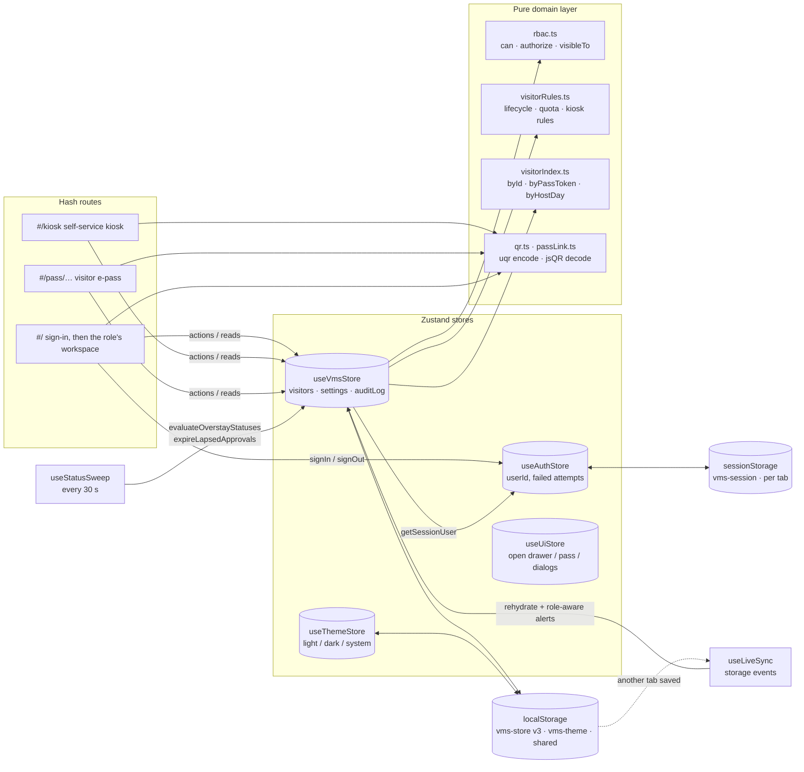
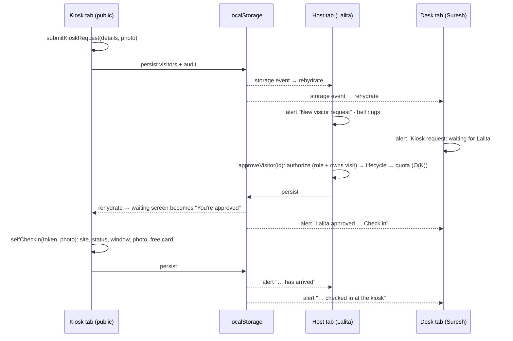
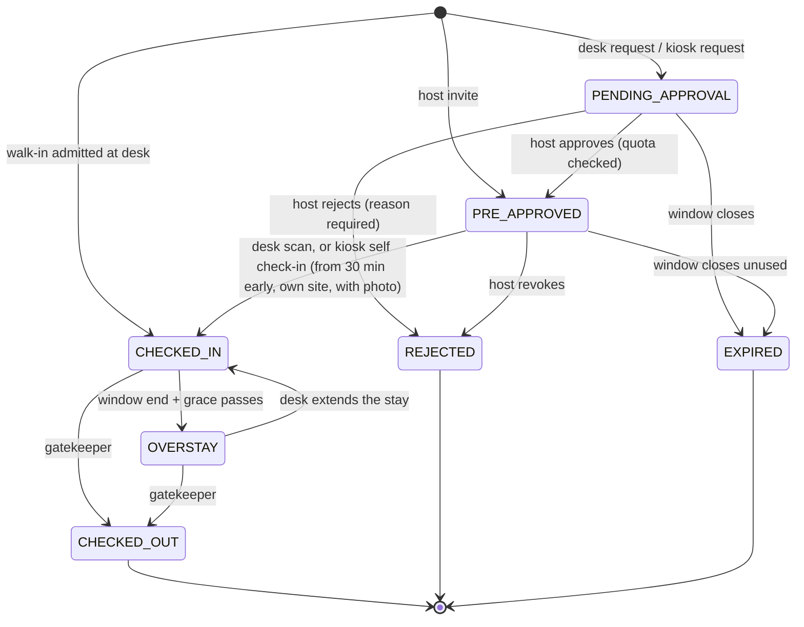

# Architecture

This document explains how PassKey VMS is put together, how it meets the case study's evaluation criteria, what each core operation costs, and how the design would change for production. For the feature tour and setup, see [README.md](README.md).

## Contents

1. [System overview](#system-overview)
2. [Evaluation criteria fulfilment](#evaluation-criteria-fulfilment)
3. [Algorithm and complexity analysis](#algorithm-and-complexity-analysis)
4. [State model](#state-model)
5. [Design decisions](#design-decisions)
6. [Anticipated interview Q&A](#anticipated-interview-qa)

---

## System overview

The app has four layers. Each layer depends only on the layers below it.

| Layer | Files | Responsibility |
| --- | --- | --- |
| **Pages and UI** | `src/pages/**`, `src/components/**` | Sign-in page, role workspaces, kiosk and pass page; overlays and primitives. UI never changes data directly; it calls store actions. |
| **Hooks and sync** | `src/store/hooks.ts`, `useLiveSync.ts`, `src/hooks/*` | Subscribe to the smallest slice of state needed, memoize derived lists, and keep every open tab in step. |
| **Stores** | `src/store/useVmsStore.ts`, `useAuthStore.ts`, `session.ts`, `useThemeStore.ts`, `useUiStore.ts` | The shared visitor data (every action runs authorize → validate → check lifecycle → commit → audit), the tab's session, the theme, and which overlay is open. |
| **Domain** | `src/lib/rbac.ts`, `visitorRules.ts`, `visitorIndex.ts`, `auth.ts`, `qr.ts`, `passLink.ts`, `src/types/vms.ts` | Pure TypeScript with no React or Zustand: permissions, lifecycle rules, validation, lookup indexes, password hashing, QR and pass links. |

The split between the two storages is what makes multiple users possible on one machine. **Who you are** lives in `sessionStorage`, which is private to each tab. **What happened** lives in `localStorage`, which every tab shares. So a gatekeeper, a host and the kiosk can run side by side in three tabs and work on the same visits.

A kiosk request travelling to a host and back, across three tabs:

Store actions **never throw on a business-rule failure**. They return `{ ok: true, data } | { ok: false, error }`. The `error` carries:

- a code: `UNAUTHORIZED`, `FORBIDDEN`, `NOT_FOUND`, `VALIDATION`, `INVALID_TRANSITION`, `QUOTA_EXCEEDED` or `CONFLICT`;
- a human-readable message;
- per-field messages, for validation errors.

`lib/feedback.ts` turns these results into toasts, so every button reports the same way.

---

## Evaluation criteria fulfilment

| Criterion | How it is met | Where |
| --- | --- | --- |
| **1. Complexity estimation** | Every hot path has a stated bound (next section). Lookup indexes make id and pass-token queries O(1) and the quota check O(K) instead of O(N). | `lib/visitorIndex.ts`, `lib/visitorRules.ts` |
| **2. User experience** | <ul><li>Personal sign-in with one-click demo accounts.</li><li>A purpose-built view per role, plus a touch-first kiosk.</li><li>Live alerts across tabs, a toast for every operation, and inline validation that shows every problem at once.</li><li>QR scanning three ways; light and dark themes with a circular reveal; count-up stats and staggered entrances.</li><li>⌘K search, and reduced-motion support.</li></ul> | `pages/**`, `components/**`, `lib/feedback.ts` |
| **3. Error handling** | <ul><li>Typed action results instead of exceptions.</li><li>RBAC checks, host ownership and site scope on every action.</li><li>An explicit lifecycle state machine, with validation re-run inside the store.</li><li>Sign-in lockout.</li><li>Camera fallbacks: upload, mock photo, typed pass code.</li><li>Damaged pass links rejected, and `localStorage` writes that warn instead of crashing.</li><li>Error boundaries per panel.</li></ul> | `store/*`, `lib/rbac.ts`, `components/layout/ErrorBoundary.tsx` |
| **4. Performance** | <ul><li>Debounced search; memoized filtering; narrow store subscriptions.</li><li>Indexes cached per list version; 10 rows per page; photos compressed to about 20 kB.</li><li>Role screens, the kiosk and the pass page load as separate chunks, and the 130 kB QR decoder only when a scanner opens.</li><li>Camera frames downscaled to 720 px before decoding.</li></ul> | `App.tsx`, `lib/qr.ts`, `components/visitor/PassScanner.tsx` |
| **5. Scalability** | <ul><li>Domain rules are pure and portable to a server unchanged.</li><li>Permissions are data (a matrix plus scopes).</li><li>Persisted state is versioned with migrations.</li><li>Typed results map one-to-one onto API responses.</li><li>The cross-tab event flow has the same shape as a production push channel (see Q&A).</li></ul> | `lib/*`, `types/vms.ts`, persist config |
| **6. Functionality** | <ul><li>Personal logins with RBAC.</li><li>Registration with a mandatory photo.</li><li>Two-way host approval, live.</li><li>Pre-approval with a date and window, and automatic expiry of unused passes.</li><li>Admin-set quota (default 5 per host per day).</li><li>Check-in and check-out with temp cards, and stay extensions.</li><li>Overstay detection.</li><li>Scannable QR e-passes, shareable by link, email and WhatsApp.</li><li>A self-service kiosk.</li><li>An audit trail including sign-ins.</li><li>Dark mode.</li><li>A resettable mock database.</li></ul> | README feature walkthrough |

Correctness is covered by **31 Vitest tests** (`npm test`):

- the lifecycle, window, quota, card and validation rules;
- the RBAC matrix and its scopes;
- the pass-link round trip;
- a QR encode → rasterize → decode round trip;
- end-to-end store workflows signed in as the real demo accounts: lockout, cross-role refusals, overstay → extension → check-out, and kiosk request → host approval → self check-in.

---

## Algorithm and complexity analysis

The symbols used below:

- `N` = visits in the store;
- `K` = one host's bookings on one day;
- `P` = the temp-card pool (899 cards);
- `A` = audit entries (capped at 300);
- `F` = pixels in one downscaled camera frame (at most 720 × 540).

| Operation | Time | Notes |
| --- | --- | --- |
| Table search and multi-predicate filter | **O(N)** per run | `filterVisitors` checks status, type, date range and text in one pass. Search input is debounced by 250 ms and the result memoized. |
| Sort for the desk | **O(N log N)** | Overstays first, then by window; one page of 10 rows is rendered. |
| RBAC scoping (`visibleTo`) | **O(N)** | Admin: all; gatekeeper: their site; host: their own visitors. Memoized per list version and user. |
| Visitor by id, pass token → visitor | **O(1)** | `Map` lookups in `visitorIndex.ts`: what a QR scan resolves through. |
| Daily quota check | **O(K)** | `countApprovalsForDay` reads only the host/day bucket (`byHostDay`). |
| Building the indexes | **O(N)**, once per list version | The `visitors` array is the `WeakMap` cache key; one pass builds all three maps. |
| Overstay and expiry sweeps | **O(N)** per sweep | On mount, every 30 s and on rehydration; they write only when something changed. |
| Next free temp card | **O(N + P)** | Cards held on site go into a `Set`; the lowest free number from TC-101 wins. |
| Single-visitor update | **O(N)** | Immutable `map`, so React and Zustand detect the change by reference. |
| Audit append | **O(A)**, A ≤ 300 | Prepend and trim, so the saved log can never grow without limit. |
| Cross-tab sync | **O(N)** per remote change | Rehydrate from `localStorage`, then diff old and new statuses by id (`Map`) to decide which alerts concern this user. |
| QR decode | **O(F)** per frame, at 4 frames a second | Frames are downscaled before decoding, and a `busy` flag drops frames rather than queueing them on slow devices. |
| QR encode | **O(M²)** for an M × M code | A 36-character token is version 3 (29 × 29), memoized per token and drawn as one SVG path with runs merged. |
| Sign-in | **O(1)** | One SHA-256 digest (Web Crypto) and one account lookup. |

**Space.** The store holds:

- O(N) for the visits;
- O(N) for the current version's indexes (old versions are garbage-collected with their array);
- O(A) with A ≤ 300 for the audit log.

Photos are the largest item. At about 20 kB each, roughly 200 photographed visits fit inside the ~5 MB `localStorage` budget. If a write still fails, the store warns and keeps working in memory.

**The honest trade-off.** Immutability makes each mutation O(N), and every tab re-reads the whole data set when another tab saves. At one site's daily volume that is microseconds. At 50,000 visits a day the answer is a server with paginated reads and pushed deltas, as the Q&A explains, not a cleverer client structure.

---

## State model

### Visit lifecycle

The state machine is `TRANSITIONS` in `lib/visitorRules.ts`. Every action checks `canTransition` before it commits.

### Role-based access control

Permissions are data, in `lib/rbac.ts`, and `authorize(user, permission, visitor?)` checks four things in order:

1. **Signed in.** Otherwise the action fails with `UNAUTHORIZED`.
2. **The role holds the permission.** Otherwise `FORBIDDEN`.
3. **Host ownership.** A host can only decide on their own visitors.
4. **Site scope.** The desk can only act on visits booked at its own site.

| Permission | Gatekeeper | Host Employee | Super Admin |
| --- | :---: | :---: | :---: |
| `visitor:register-walk-in` | ✓ | | |
| `visitor:check-in` / `check-out` / `extend` | ✓ (own site) | | |
| `visitor:view-site` | ✓ | | |
| `visitor:pre-approve` | | ✓ | |
| `visitor:approve` / `reject` | | ✓ (own visitors) | |
| `visitor:view-all` | | | ✓ |
| `settings:update` | | | ✓ |

The UI asks the same `authorize()` which buttons to show. The store enforces it again on every action, so hiding a button is never the only line of defence.

The kiosk's two actions are deliberately public. They are narrow and carry their own rules (`selfCheckInProblem`):

- a visitor can only request a visit for themselves;
- they can only check in with an approved pass, for this site, inside its window, with a photo.

### Authentication and sessions

- **Accounts and hashing.** `ACCOUNTS` pairs each user with a SHA-256 hash of `email:password`, computed with Web Crypto (`lib/auth.ts`). The email acts as a salt, so identical passwords hash differently. Plain passwords exist only in `demoCredentials.ts`, which the sign-in page shows as a reviewer convenience.
- **Checking a sign-in.** `signIn` (`store/session.ts`) normalizes the email and hashes the attempt. An unknown email and a wrong password get the same message, so the form doesn't reveal which accounts exist. Five failures lock sign-in for 30 seconds.
- **Starting the session.** A successful sign-in stores only the user's id in `sessionStorage`. The user record itself is looked up from the code, so a tampered session can at most name another account's id. The next section explains why that is acceptable only in a demo.
- **Audit and the gate.** Sign-in and sign-out are audited. `App.tsx` renders the sign-in page until a session exists, then mounts the role's workspace keyed by user.

### Persistence and live sync

Three storage keys:

| Key | Storage | Holds | Why there |
| --- | --- | --- | --- |
| `vms-store` (version 3) | `localStorage` | visitors, settings, audit log | Shared by every tab: the "database". |
| `vms-session` | `sessionStorage` | the signed-in user's id | Private to one tab, so different people can work side by side. |
| `vms-theme` | `localStorage` | light / dark / system | A device preference; applied before first paint by an inline script in `index.html`. |

- **Filters are not saved.** They are per-tab UI state.
- **Old saves are migrated.** `migrate` discards version-1 data. `merge` takes only the fields it knows, so the version-2 demo role is ignored.
- **Stale statuses are fixed on load.** `onRehydrateStorage` runs both sweeps, so anything that lapsed while the app was closed is corrected.
- **Other tabs' writes are picked up.** `useLiveSync` listens for `storage` events on `vms-store`. Browsers fire these only in *other* tabs, so a tab is never alerted about its own actions. On an event it rehydrates, then diffs the statuses and raises only the alerts that concern its signed-in user. The kiosk rehydrates but raises no staff alerts.

---

## Design decisions

| Decision | Why |
| --- | --- |
| **Session per tab, data shared** | It is the smallest design that makes multi-user workflows real without a server: three roles in three tabs, updating each other live. |
| **`storage` events for sync** | Built into every browser, needs no server, and fires only in other tabs, so there's no echo or feedback loop. `BroadcastChannel` would also work; `storage` comes free with the persistence already in place. |
| **The QR code encodes only the token** | A 36-character UUID gives a small version-3 code that scans easily from a phone screen, and a photographed pass leaks nothing. The desk resolves the token against its own records. |
| **Pass links carry the details** | With no server, a link must be self-contained to open on the visitor's phone. The details are display-only; check-in trusts only the token lookup. |
| **Hash routing** | `#/kiosk` and `#/pass/…` work on any static host with no rewrite rules. |
| **The kiosk as a separate, public route** | Visitors never see staff screens, and the kiosk's two actions are the only unauthenticated ones, each with its own narrow rules. |
| **ISO instants for windows, plus an `expectedDate` day key** | Windows can cross midnight; the day key drives quota counting and date filtering. |
| **An `EXPIRED` status, and `OVERSTAY → CHECKED_IN`** | Unused passes must "expire automatically"; an extension clears an overstay without inventing a separate status. |
| **Pure domain layer, thin stores** | Rules are unit-tested directly and would move to a server unchanged. |
| **A full dark palette in CSS variables** | Components have almost no `dark:` variants. The `.dark` class redefines every token, and status colours become translucent tints that sit well on dark surfaces. |
| **Theme switch through the View Transitions API** | One `startViewTransition` plus a `clip-path` circle gives the reveal. Browsers without it, and users who prefer reduced motion, get an instant switch. |
| **Code splitting** | The main chunk is about 380 kB (122 kB gzipped). The role workspaces (11–22 kB), the kiosk (18 kB), the pass page (4 kB) and jsQR (130 kB) load on demand. |
| **Stitch design tokens from the written spec** | Stitch's auto-generated palette contradicted its own DESIGN.md; the explicit spec values won. |

---

## Anticipated interview Q&A

### 1. How would you scale this to 50,000 visitors per day?

The client already keeps its hot paths off full scans, but at that volume the data belongs on a server, and the client should hold only what it displays.

- **Storage.** PostgreSQL with `visits` partitioned by `expected_date`. Add indexes on `(site_id, expected_date, status)` for the desk view, `(host_id, expected_date)` for quota checks (the same shape as `byHostDay`), and a unique index on `pass_token`.
- **Reads.** Paginated APIs with keyset pagination, and full-text search through a trigram index or OpenSearch. The table already renders one page at a time.
- **Writes.** The quota check must be atomic, so two approvals racing each other can't both pass. Use `SELECT … FOR UPDATE` on a per-host-per-day counter, or a conditional `UPDATE … WHERE approvals < limit`.
- **Sweeps.** Schedule a delayed job at each visit's `window_end + grace` instead of re-scanning: O(1) per visit.
- **Throughput.** 50,000 visits a day is about 0.6 writes per second on average, with lobby peaks perhaps 20 times higher. One Postgres primary handles that; the real work is caching and paginating the read path.

### 2. How would real-time sync work in production, beyond tabs of one browser?

The event flow already exists. Today the transport is `localStorage` plus `storage` events. In production:

1. **Write with an event.** An action becomes an API call (`POST /visits/:id/approve`). The server re-runs the same guards the store runs today (authentication, role, ownership or site scope, lifecycle, quota), then writes the row and an outbox event (`visit.approved`) in one transaction.
2. **Publish.** A dispatcher publishes the event to Redis Streams or Kafka.
3. **Push.** A gateway pushes it over **Server-Sent Events** (one-way, proxy-friendly, resumes with `Last-Event-ID`) or WebSockets to the sessions allowed to see it: the host, the site's desk and the kiosk. Offline hosts get push, email or SMS.
4. **Apply.** The client applies events as patches. Events carry a version and actions are idempotent, so a replay after a reconnect is harmless. `useLiveSync` already turns remote changes into role-aware alerts; only its input changes.

This also removes the demo's last-write-wins race between two tabs, because the server serializes writes.

### 3. Is checking passwords in the browser secure?

No, and the app says so.

- **What the demo does.** It stores only salted hashes, gives identical errors for unknown accounts and wrong passwords, rate-limits with a lockout, and audits every session. But the hashes ship to the browser, and anyone with dev tools can change `sessionStorage`.
- **What production would do.** Sign in through the company's identity provider (OIDC/SAML SSO), with MFA for admins. Then:
  - keep sessions in `HttpOnly`, `Secure`, `SameSite` cookies;
  - store credentials server-side as Argon2 or bcrypt hashes;
  - have the server enforce every permission, as the store does now.

The RBAC module is written to move there unchanged.

### 4. How do you stop a visitor reusing a screenshot of their QR pass?

- **Today.** The token is an opaque random UUID. Check-in requires the pass to be approved, for this site and inside its window (at most 30 minutes early), and the lifecycle forbids a second check-in. The kiosk also takes a live photo, which the desk can compare against the visitor.
- **Production additions.**
  - A **signed, expiring token** (HMAC or JWT over the visit id, window and a nonce), so it cannot be forged.
  - For high-security sites, a **rotating code** (TOTP-style, refreshed every 30 s in a wallet pass), which defeats screenshots entirely.

### 5. How are camera privacy and image compression handled?

- **Consent and minimal capture.** The camera starts only when someone chooses it (or opens a scanner). It stops the moment a frame is captured or decoded, or the dialog closes, and audio is never requested.
- **Graceful denial.** Registration and scanning always have a non-camera path: upload, a mock photo, or a typed pass code.
- **Compression.** Photos are centre-cropped and re-encoded client-side as a 320 px JPEG at 82% (about 15–25 kB). Scanner frames are decoded in memory and never stored.
- **Production storage.** Direct upload to object storage through pre-signed URLs, encrypted at rest, with automatic deletion after a retention period (for example 24 hours after check-out) to meet rules such as India's DPDP Act. Every access would be audited.

### 6. How is it tested?

`npm test` runs 31 Vitest tests in Node, with no browser needed. The domain layer is pure, and the store skips persistence outside a browser.

- **Rules:** lifecycle transitions, overstay and expiry edges, the 30-minute early check-in, quota counting (including revoked and walk-in cases), card allocation, validation, and phone search.
- **RBAC:** role permissions, and the unauthorized, forbidden, host-ownership and site-scope refusals.
- **Passes:** pass-link round trips (with non-ASCII names), damaged links, and token extraction from scans, codes and links. QR codes go encode → rasterize → jsQR decode.
- **Workflows:** against the real store, signed in with the real demo passwords:
  - every account signs in, and sign-in locks after five failures;
  - each role is refused the others' actions;
  - pre-approval → check-in → overstay → extension → check-out;
  - the admin-set quota;
  - kiosk request → host approval → self check-in;
  - revoked and unknown passes are refused.

Next would come component tests (Testing Library) for form flows, and Playwright for the three-tab walkthrough with `getUserMedia` stubbed.

### 7. Why Zustand rather than Redux Toolkit or React Context?

- **Selector subscriptions.** The table must not re-render when the audit log changes.
- **Persistence.** `persist` gives versioned migrations and a pluggable storage engine: `sessionStorage` for the session, `localStorage` for data.
- **Outside React.** `getState()` works outside components, which is what `session.ts`, the sweeps and the sync listener need.

Zustand does all of that in about 1 kB with no provider tree. Context would re-render every consumer on each change. Redux Toolkit would work, but adds ceremony without a benefit at this size.

### 8. Why does the quota count visit days rather than days the approvals were created?

The quota is a security control on how many guests a host brings in on a given day. Counting by creation date would let a host approve 5 today for Friday, 5 more tomorrow for Friday, and so on. Keying on the visit day (`expectedDate`) closes that hole. Revoking a pass frees its slot, and walk-ins admitted directly by the desk are excluded, since the host never approved them.
