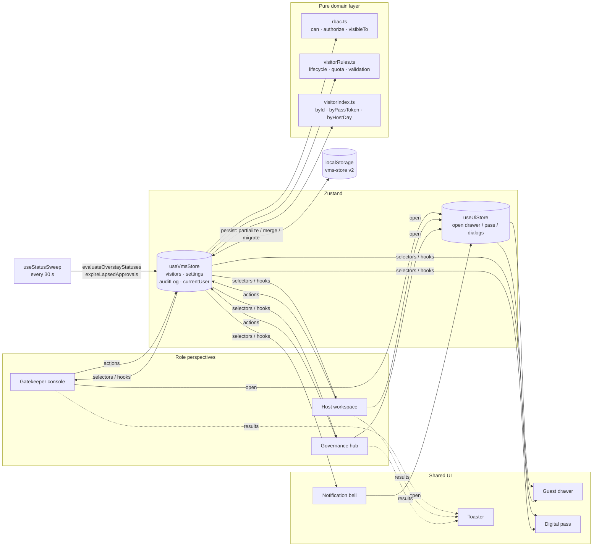
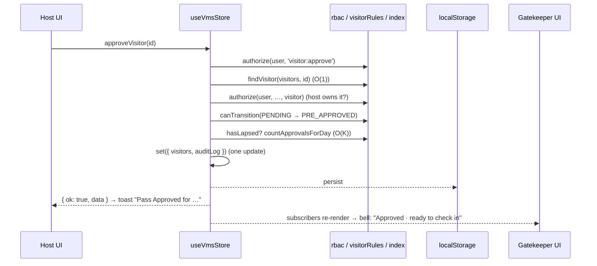
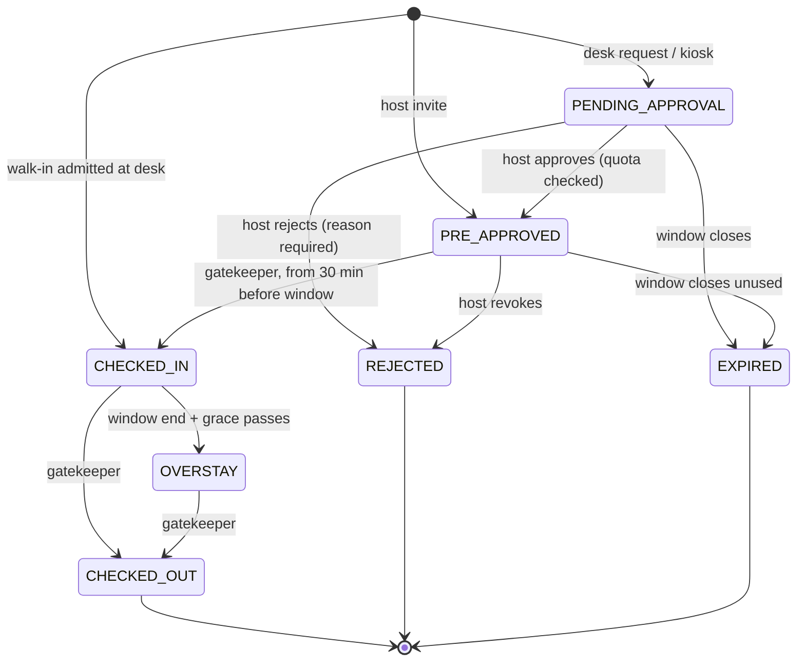

# Architecture

This document explains how PassKey VMS is put together, how it meets the case study's evaluation criteria, what each core operation costs, and how the design would change for production. For the feature tour and setup, see [README.md](README.md).

## Contents

1. [System overview](#system-overview)
2. [Evaluation criteria fulfilment](#evaluation-criteria-fulfilment)
3. [Algorithm and complexity analysis](#algorithm-and-complexity-analysis)
4. [State model](#state-model)
5. [Design decisions](#design-decisions)
6. [Anticipated interview Q&A](#anticipated-interview-qa)

---

## System overview

The app has four layers. Each layer depends only on the layers below it.

| Layer | Files | Responsibility |
| --- | --- | --- |
| **UI** | `src/components/**` | Role screens, overlays and primitives. It never changes data directly; it calls store actions. |
| **Hooks** | `src/store/hooks.ts`, `src/hooks/*` | Subscribe to the smallest slice of state needed and memoize derived lists. |
| **Store** | `src/store/useVmsStore.ts` | The single source of truth. Every action runs authorize → validate → check lifecycle → commit → audit. |
| **Domain** | `src/lib/rbac.ts`, `visitorRules.ts`, `visitorIndex.ts`, `src/types/vms.ts` | Pure TypeScript with no React or Zustand: permissions, lifecycle rules, validation and lookup indexes. |

A single action, for example a host approving a walk-in request, runs like this:

Store actions **never throw on a business-rule failure**. They return `{ ok: true, data } | { ok: false, error }`, where `error` has a code (`FORBIDDEN`, `NOT_FOUND`, `VALIDATION`, `INVALID_TRANSITION`, `QUOTA_EXCEEDED`, `CONFLICT`), a human-readable message and per-field messages. `lib/feedback.ts` turns these results into toasts, so every button reports the same way.

---

## Evaluation criteria fulfilment

The case study lists six evaluation points. This is where each is addressed.

| Criterion | How it is met | Where |
| --- | --- | --- |
| **1. Complexity estimation** | Every hot path has a stated bound (see the next section). Lookup indexes make id and pass-token queries O(1) and the quota check O(K) instead of O(N). Complexity notes sit next to the code. | `lib/visitorIndex.ts`, `lib/visitorRules.ts` |
| **2. User experience** | Three purpose-built role views; a toast for every operation; inline validation that shows every problem at once and focuses the first; a live quota meter; live overstay durations; ⌘K search; confirmation before check-out; empty states with a next step; a drawer that becomes a bottom sheet on tablets; reduced-motion support. | `components/**`, `lib/feedback.ts` |
| **3. Error handling** | Typed action results instead of exceptions; RBAC and ownership checks on every action; an explicit lifecycle state machine; validation re-run inside the store even when the form already checked; a camera fallback chain; `localStorage` writes that warn instead of crashing when the quota is full; error boundaries per panel with retry and reset. | `store/useVmsStore.ts`, `lib/rbac.ts`, `components/layout/ErrorBoundary.tsx` |
| **4. Performance** | Debounced search (250 ms); memoized filtering; components subscribe to narrow slices of state; indexes cached per list version; only 10 rows rendered per page; photos compressed to about 20 kB; role screens lazy-loaded as separate chunks. | `components/gatekeeper/VisitorTable.tsx`, `App.tsx` |
| **5. Scalability** | Domain rules are pure and portable to a server unchanged. Permissions are data (a matrix), so a new role or capability is a one-line change. Persisted state is versioned with a migration hook. Typed action results would map one-to-one onto API responses. See the Q&A for the 50,000-visitor design. | `lib/*`, `types/vms.ts`, persist config |
| **6. Functionality** | Registration with mandatory photo; two-way host approval; pre-approval with date and window; automatic expiry of unused passes; admin-set quota (default 5 per host per day); check-in and check-out with temp cards; overstay detection; digital pass with a QR placeholder; audit trail; role switching; resettable mock database. | See README feature walkthrough |

---

## Algorithm and complexity analysis

`N` = visits in the store, `K` = one host's bookings on one day, `P` = the temp-card pool (899 cards), `A` = audit entries (capped at 300).

| Operation | Time | Notes |
| --- | --- | --- |
| Table search and multi-predicate filter | **O(N)** per run | `filterVisitors` checks status, type, date range and text in one pass. Search input is debounced by 250 ms, so a burst of typing costs one run, not one per keystroke. The result is memoized with `useMemo` and recomputes only when the visitors, user, filters or the 30-second clock change. |
| Sort for the desk | **O(N log N)** | `sortForDesk` orders by status priority (overstays first), then by window. It runs on the already-filtered list, then one page of 10 rows is rendered. |
| Status tab counts | **O(N)** | One pass over the filtered list (`countByStatus`). |
| Visitor by id, pass token → visitor | **O(1)** | `Map` lookups in `visitorIndex.ts`. |
| Daily quota check | **O(K)** | `countApprovalsForDay` reads only the host/day bucket (`byHostDay`) rather than scanning every visit. |
| Building the indexes | **O(N)**, once per list version | The store replaces the `visitors` array on every change, so the array itself is the cache key in a `WeakMap`. The first lookup after a change builds `byId`, `byPassToken` and `byHostDay` in a single pass; every later lookup against that version reuses them. |
| Overstay detection | **O(N)** per sweep | `isOverstaying`: status is `CHECKED_IN` and `now > timeWindowEnd + grace`, compared as parsed ISO instants. Runs on mount, every 30 s and on rehydration. It only writes to the store (and so re-renders) when at least one visitor changes. |
| Pass expiry | **O(N)** per sweep | `hasLapsed`: status is pending or pre-approved and `now > timeWindowEnd`. |
| Next free temp card | **O(N + P)** | Collects the cards held on site into a `Set`, then takes the lowest free number from TC-101. |
| Single-visitor update | **O(N)** | Copying the array immutably (`map`) is what lets React and Zustand detect the change by reference. |
| Audit append | **O(A)**, A ≤ 300 | New entry prepended and the log trimmed to 300, so the saved log can never grow without limit. |

**Space.** O(N) for the visits, plus O(N) for the indexes of the current version (old versions are garbage-collected with their array), plus O(A) with A ≤ 300 for the audit log. Photos are the largest item per visit. Compressing them to a 320 px JPEG of about 20 kB keeps roughly 200 photographed visits inside the ~5 MB `localStorage` budget. If a write still fails, the store logs a warning and keeps working in memory instead of breaking the action.

**The honest trade-off.** Because state is immutable, every mutation costs O(N) (a new array), and the first lookup after a mutation rebuilds the index in O(N). At the scale of one site's day, that is a few thousand records and microseconds. At 50,000 visits per day the right fix is not a cleverer client structure but moving the data to a server, as the Q&A below explains.

---

## State model

### Visit lifecycle

The state machine lives in `TRANSITIONS` in `lib/visitorRules.ts`. Every action checks `canTransition` before it commits, so a visit that has been checked out cannot be checked in again, and a pending request cannot be checked in before its host approves it.

### Role-based access control

Permissions are data, in `lib/rbac.ts`:

| Permission | Gatekeeper | Host Employee | Super Admin |
| --- | :---: | :---: | :---: |
| `visitor:register-walk-in` | ✓ | | |
| `visitor:check-in` / `visitor:check-out` | ✓ | | |
| `visitor:pre-approve` | | ✓ | |
| `visitor:approve` / `visitor:reject` | | ✓ (own visitors only) | |
| `visitor:view-all` | ✓ | | ✓ |
| `settings:update` | | | ✓ |

Hosts only ever see their own visitors (`visibleTo`), and approve and reject also check ownership. The UI asks `can()` to decide which buttons to show; the store enforces the same rules again, so hiding a button is never the only line of defence.

### Persistence

`persist` saves `{ role, visitors, settings, auditLog }` under the key `vms-store` at version 2:

- **Filters are not saved.** They are per-session UI state.
- **Only the role is saved, not the whole session.** `merge` rebuilds the session from the role, so demo users stay in sync with the code, and an unknown saved role falls back safely.
- **Older data is discarded.** `migrate` replaces any version-1 data with fresh demo data rather than loading records that lack `office`, `approvedAt` or the audit log.
- **Stale statuses are fixed on load.** `onRehydrateStorage` runs both sweeps, so anything that lapsed while the app was closed is corrected.
- **Failed writes don't break actions.** A safe storage wrapper catches write errors, such as a full quota.

---

## Design decisions

| Decision | Why |
| --- | --- |
| **ISO instants for the visit window, plus an `expectedDate` day key** | The reference screens show a walk-in window running *Sun 4:21 PM → Mon 12:21 AM*. Instants handle windows that cross midnight; the local day key drives quota counting and date filtering. |
| **An `EXPIRED` status beyond the original six** | The brief requires pre-approvals to "expire automatically" when unused. A real status keeps every list, filter and badge honest without extra derived logic. |
| **Two walk-in paths** | *Check in now* admits the visitor immediately, as originally specified. *Send for host approval* is the brief's approval workflow. The guard chooses per visitor. |
| **`approvedAt` and `source` on each visit** | The quota counts approvals the host issued. Walk-ins the desk admitted directly carry no `approvedAt`, so they never use up a host's quota. |
| **Pure domain layer, thin store** | Rules can be unit-tested and moved to a server unchanged. The store only orchestrates. |
| **A separate UI store** | Any component (a table row, the bell, a toast action) can open the shared drawer or pass without prop drilling, and UI state is never persisted. |
| **A single SVG for the pass** | What is shown, printed and downloaded are guaranteed identical. The downloaded file uses hex colours because it can't read the app's CSS variables. |
| **Stitch design tokens from the written spec** | Stitch's auto-generated palette (pure-black primary, bluish surfaces) contradicted its own DESIGN.md and colour overrides. The explicit spec values won: slate-900 primary, slate-50 canvas, zinc-200 hairlines. |
| **Tailwind v4 with `tailwind.config.js` via `@config`** | The scales live in the JS config as originally requested. The two default-transition variables live in `@theme` instead, because v4 inlines JS-config values and those two are read as live CSS variables. Setting them in the JS config silently disabled every transition. |
| **Role screens lazy-loaded** | The main chunk is about 452 kB (145 kB gzipped); the gatekeeper, host and admin screens load on demand (about 18, 22 and 8 kB). |

---

## Anticipated interview Q&A

### 1. How would you scale this to 50,000 visitors per day?

The client already keeps its hot paths off full scans, but at that volume the data belongs on a server, and the client should only hold what it displays.

- **Storage.** PostgreSQL with a `visits` table partitioned by `expected_date`. Indexes on `(site_id, expected_date, status)` for the desk view, `(host_id, expected_date)` for quota checks (the same shape as `byHostDay` today), and a unique index on `pass_token`.
- **Reads.** Paginated APIs (`GET /sites/:id/visits?date=&status=&q=&cursor=`) using keyset pagination; full-text search through a trigram or GIN index, or OpenSearch for fuzzy matching. The table renders one page at a time already, so the UI barely changes. For very large pages, add row virtualization.
- **Writes.** The quota check must be atomic. Two hosts' approvals racing each other should not both pass. Use `SELECT … FOR UPDATE` on a per-host-per-day counter row, or a conditional `UPDATE … WHERE approvals < limit`.
- **Sweeps.** Move overstay and expiry detection to a scheduled worker, or better, schedule a delayed job at each visit's `window_end + grace`. That is O(1) per visit instead of re-scanning.
- **Throughput.** 50,000 visits a day is about 0.6 writes per second on average, with lobby peaks perhaps 20 times higher. One Postgres primary handles that easily; the real work is keeping the read path cached and paginated.

### 2. How would real-time approvals work in production, using WebSockets or SSE?

Today the host's bell and the desk's *ready to check in* list update because both roles share one in-memory store. In production:

1. The desk submits a request with `POST /visits`, which writes the row and an outbox event (`visit.requested`) in the same transaction.
2. A dispatcher publishes the event to a Redis Streams or Kafka topic.
3. A gateway pushes it to the host's open sessions over **Server-Sent Events** (one-way, works through proxies, reconnects automatically with `Last-Event-ID`) or WebSockets if two-way messaging is needed. Offline hosts get web push, email, SMS or an IVR call, as the brief lists.
4. The host approves with `POST /visits/:id/approve`. The server re-runs the same guards the store runs today (role, ownership, lifecycle, quota) and emits `visit.approved`, which reaches the desk's stream.
5. The client applies events to the store as patches. Actions are idempotent and events carry a version, so a replayed event after a reconnect is harmless.

Because store actions already return typed results, only their implementation changes: instead of mutating local state, they call the API and reconcile.

### 3. How are camera privacy and image compression handled?

- **Consent and minimal capture.** The camera starts only when the guard clicks **Start camera**. The stream is stopped the moment a frame is captured, the capture is cancelled or the dialog closes, so the camera light never stays on. Audio is never requested.
- **Graceful denial.** A denied permission or a missing camera shows a toast and falls back to upload or a mock photo; registration is never blocked.
- **Compression.** Frames and uploads are centre-cropped and re-encoded client-side as a 320 px JPEG at 82% quality (about 15–25 kB, down from megabytes). Only the compressed image is kept.
- **Storage.** In this demo, photos stay in the browser. In production they would upload directly to object storage through a short-lived pre-signed URL, be encrypted at rest, be referenced by key rather than embedded, and be deleted automatically after a retention period (for example 24 hours after check-out) to meet data-protection rules such as India's DPDP Act. Access to them would be written to the audit log.

### 4. How do you stop a visitor reusing a screenshot of their QR pass?

Today the token is an opaque random UUID, and the store already refuses check-in outside the approved window (it allows at most 30 minutes early). In production:

- The QR code would encode a **signed, expiring token** (HMAC or JWT over the visit id, window and a nonce), so it cannot be forged or edited.
- Tokens are **single-use for check-in**: the lifecycle forbids a second check-in on the same visit.
- For high-security sites, a **rotating code** (TOTP-style, refreshed every 30 seconds in the wallet pass) defeats screenshots entirely.
- The guard still matches the **photo** on the pass against the person at the desk, which is why photo capture is mandatory.

### 5. How would you test this?

- **Unit tests (Vitest)** for the pure layer, which is already written for it: lifecycle transitions, quota counting including revoked and walk-in cases, time windows across midnight and the early check-in edge, temp-card allocation, validation, filtering, and the RBAC matrix.
- **Store tests:** call actions against a fresh store with an injected clock (sweeps already accept `now`) and assert on the typed results and audit entries.
- **Component tests (Testing Library)** for flows such as walk-in validation, focus on the first invalid field, and the quota warning disabling **Confirm**.
- **End-to-end tests (Playwright)** for the two-way approval across role switches, with `getUserMedia` stubbed to cover the camera-denied path.

### 6. Why Zustand rather than Redux Toolkit or React Context?

The store is small, needs selector-level subscriptions for performance (the table must not re-render when the audit log changes), and needs persistence with versioned migrations. Zustand provides all three in about 1 kB with no provider tree. Context would re-render every consumer on each change. Redux Toolkit would work, but adds ceremony without a benefit at this size. The domain logic doesn't depend on Zustand, so switching later would only touch the store file.

### 7. Why does the quota count visit days rather than days the approvals were created?

"Max 5 visitors per employee per day" is a security control on how many guests a host brings into the building on a given day. If it counted approvals by creation date, a host could approve 5 today for Friday, 5 tomorrow for Friday, and so on, and flood Friday. Keying on the visit day (`expectedDate`) closes that hole. Revoking a pass frees its slot, and walk-ins the desk admits directly are excluded, since the host never approved them.
